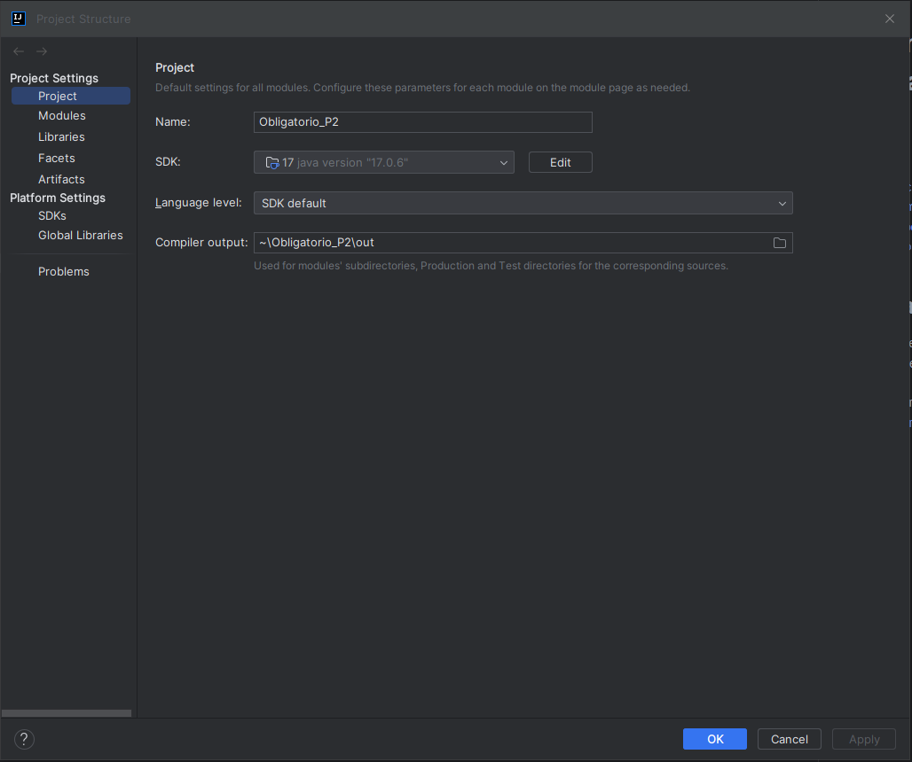
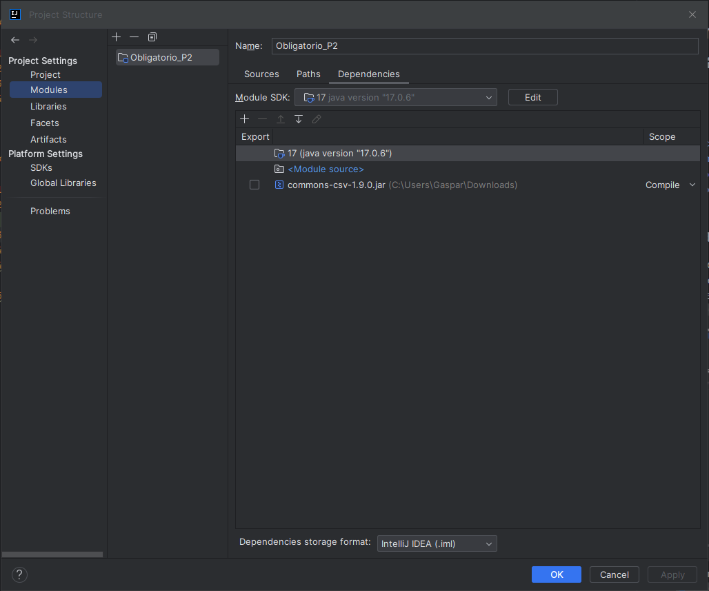
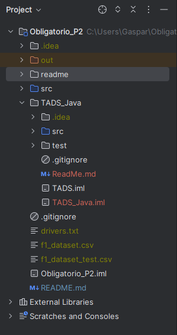

# Informe Obligatorio Progamación2

## Índice

1. [Instalacion del Programa](#instalacion-del-programa)
2. [Diagrama UML de Clases](#diagrama-uml-de-clases)
3. [Descripción de los Procesos](#descripción-de-los-procesos)
4. [Medición de Eficiencia de la Aplicación](#medición-de-eficiencia-de-la-aplicación)

## Instalacion del Programa

1. Clonar el [repo del obligatorio](https://github.com/SPRAINT890/Grupo1_P2_Obligatorio.git)
2. En Project Structure, marcar el uso del SDK 17 y Language level en SDK Default 
3. Agregar a dependencias la libreria Apache CSV Reader 1.9 
4. Clonar [repo de tads](https://github.com/SPRAINT890/Grupo1_P2_Tads.git), a la raiz y marcar src como Source Root
5. Extraer los csv y el txt, en la raiz

El projecto nos deberia quedar algo parecido a esta imagen 

## Diagrama UML de Clases

