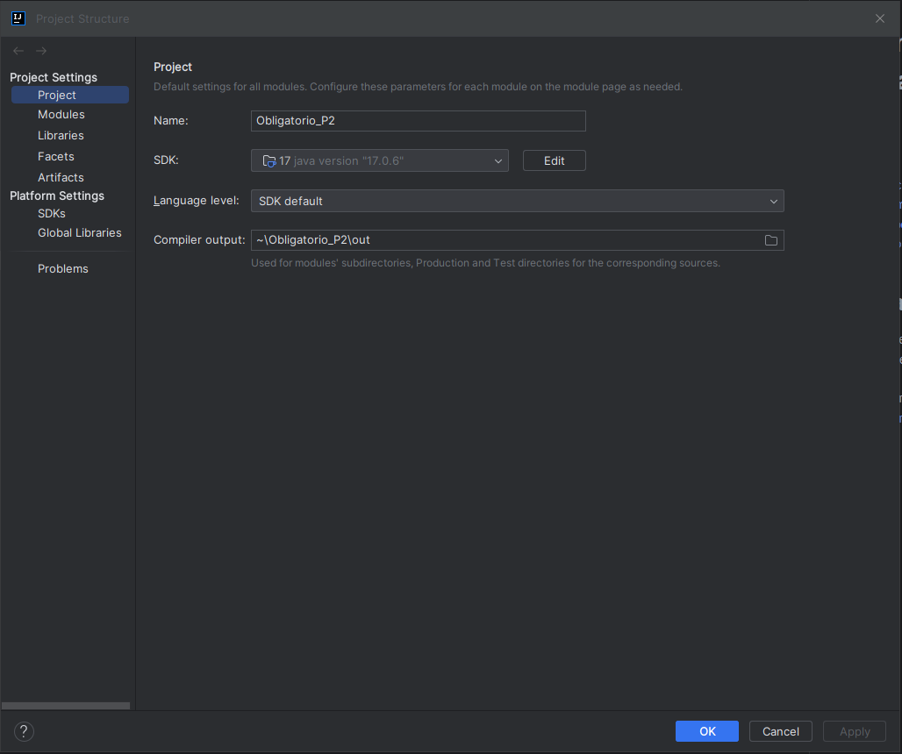
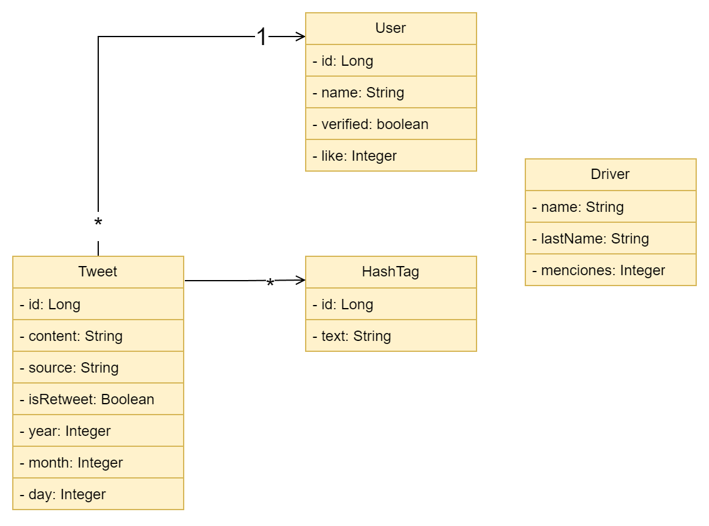

# Informe Obligatorio Progamación2
# Gaspar Morales y Juan Kowalczik

## Índice

1. [Instalacion del Programa](#instalacion-del-programa)
2. [Diagrama UML de Clases](#diagrama-uml-de-clases)
3. [Descripción de los Procesos](#descripción-de-los-procesos)
4. [Medición de Eficiencia de la Aplicación](#medición-de-eficiencia-de-la-aplicación)

## Instalacion del Programa

1. Clonar el [repo del obligatorio](https://github.com/SPRAINT890/Grupo1_P2_Obligatorio.git)
2. En Project Structure, marcar el uso del SDK 17 y Language level en SDK Default 
3. Agregar a dependencias la libreria Apache CSV Reader 1.9 
4. Clonar [repo de tads](https://github.com/SPRAINT890/Grupo1_P2_Tads.git), a la raiz y marcar src como Source Root
5. Extraer los csv y el txt, en la raiz

El projecto nos deberia quedar algo parecido a esta imagen 

## Diagrama UML de Clases

## Descripción de la carga de datos
para cargar los datos del CSV se utilizo la libreria **Apache CSV** y se creo una funcion `public static void load_csv(){...}`.
Esta funcion se encarga de leer, crear las entidades para cada fila del csv y guardar en un hashtable cerrado para el posterior uso en el programa, tambien maneja algunas condiciones de mal formateo del csv, ya que durante el desarrollo del obligatorio nos dimos cuenta que hay datos que no tienen valor o tienen valores distinto al estipulado, por esta razon hay algunos tweets que no se registran por falta de datos.

## Medicion de eficiencia de la aplicacion

### Specs usadas para las mediciones
- **Procesador** Ryzen 7 5700g
- **Memoria ram** 16GB Dual Channel

### Resultados
- Idle del programa
    - **Descripcion:** Consumo del programa despues de cargar todos los datos del csv
    - **Memoria RAM consumida:**  730 MB
    - **Tiempo de ejecución promedio:**  5s

- Funcion 1
    - **Descripcion:** Listar los 10 pilotos más mencionados
    - **Memoria RAM consumida:**  881 MB
    - **Tiempo de ejecución promedio:**  2s

- Funcion 2
    - **Descripcion:** Top 15 usuarios con más tweets
    - **Memoria RAM consumida:**  891 MB
    - **Tiempo de ejecución promedio:**  0s

- Funcion 3
    - **Descripcion:** Top 15 usuarios con más tweets
    - **Memoria RAM consumida:**  893 MB
    - **Tiempo de ejecución promedio:**  0s

- Funcion 4
      - **Descripcion:** Hashtag más usado para un día dado
      - **Memoria RAM consumida:**  921 MB
      - **Tiempo de ejecución promedio:**  0s

- Funcion 5
  - **Descripcion:** Top 7 cuentas con más favoritos
  - **Memoria RAM consumida:**  931 MB
  - **Tiempo de ejecución promedio:**  124s

- Funcion 6
    - **Descripcion:** Cantidad de tweets con una palabra o frase específicos
    - **Memoria RAM consumida:**  1157 MB
    - **Tiempo de ejecución promedio:**  0s
